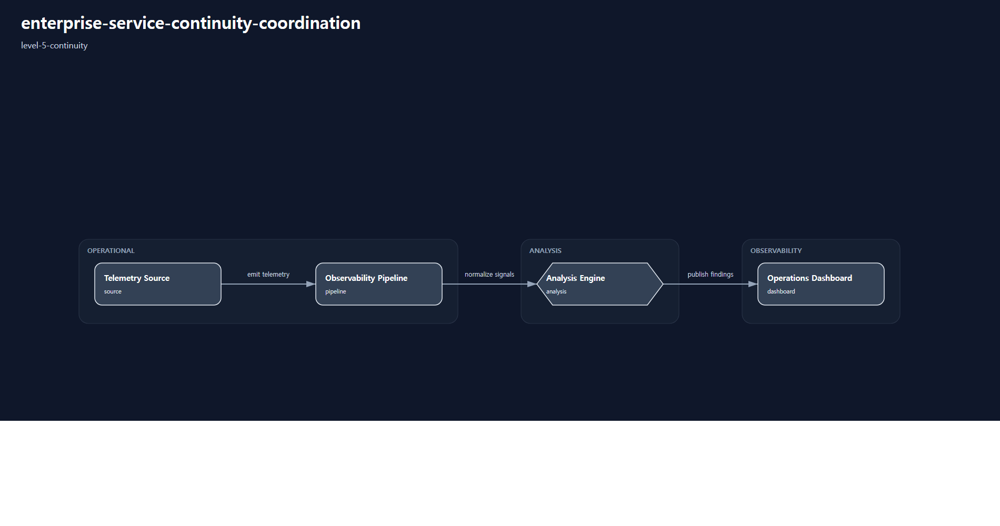

# 1. Repository Path

    /scenarios/level-5-continuity/enterprise-service-continuity-coordination

---

# 2. Scenario Metadata

| Field | Value |
|---|---|
| Scenario Name | enterprise-service-continuity-coordination |
| Lifecycle | Level-5 Continuity |
| Severity | Critical |
| Environment | Enterprise Hybrid Infrastructure |
| Validation Scope | Enterprise Continuity Coordination |

---

# 3. Scenario Purpose

This scenario establishes enterprise continuity coordination workflows for large-scale infrastructure disruption across hybrid enterprise environments.

The scenario focuses on organizational survivability visibility, executive escalation coordination, continuity governance workflows, cross-domain operational coordination, and enterprise-wide continuity validation.

---

# 4. Operational Relevance

Enterprise-scale infrastructure degradation can impact organizational service availability, operational governance, customer-facing systems, and business continuity obligations across multiple operational domains.

Operational continuity workflows require coordinated executive visibility, continuity-aware escalation management, cross-domain survivability coordination, operational governance alignment, and enterprise-wide validation visibility.

This scenario introduces continuity governance coordination and organizational survivability workflows beyond distributed technical resilience management.

---

# 5. Design Reasoning

This scenario intentionally remains within the Level-5 Continuity lifecycle boundary.

Unlike Level-4 resilience scenarios, this operational design introduces executive continuity coordination, governance-aware escalation workflows, organizational survivability visibility, and enterprise-wide continuity management.

The architecture prioritizes enterprise continuity visibility, cross-domain coordination, operational governance integration, executive escalation workflows, and continuity-oriented evidence aggregation.

The scenario intentionally focuses on continuity coordination and organizational survivability rather than infrastructure-only failover visibility.

---

# 6. Scenario Objectives

- Coordinate enterprise continuity governance workflows
- Validate executive escalation visibility
- Preserve organizational service survivability visibility
- Coordinate cross-domain operational continuity workflows
- Aggregate enterprise continuity evidence
- Validate governance-aware operational escalation workflows
- Preserve strict Level-5 Continuity lifecycle purity

---

# 7. Scenario Architecture

The operational architecture focuses on enterprise continuity coordination across hybrid organizational infrastructure environments.

Continuity governance layers coordinate executive escalation visibility, cross-domain survivability workflows, organizational continuity validation, operational governance integration, and enterprise-wide evidence aggregation.

Operational telemetry pipelines continuously validate enterprise service continuity, organizational survivability visibility, continuity escalation consistency, and governance-aware operational coordination evidence.

The architecture prioritizes enterprise continuity coordination rather than infrastructure-only survivability management.

---

# 8. Used Modules

| Module | Operational Responsibility |
|---|---|
| Enterprise Continuity Coordination Module | Coordinate governance-aware continuity workflows |
| Executive Escalation Visibility Module | Validate executive continuity escalation visibility |
| Cross-Domain Survivability Coordination Module | Coordinate enterprise operational survivability workflows |
| Operational Governance Evidence Module | Aggregate continuity governance validation evidence |

---

# 9. Used Adapters

| Adapter | Integration Responsibility |
|---|---|
| Enterprise Telemetry Visibility Adapter | Aggregate enterprise continuity telemetry |
| Governance Escalation Adapter | Coordinate executive continuity escalation visibility |
| Prometheus Adapter | Aggregate continuity-oriented telemetry metrics |
| Grafana Visualization Adapter | Present enterprise continuity visibility dashboards |
| Alertmanager Notification Adapter | Propagate governance-aware operational alerts |

---

# 10. Implementation Approach

The implementation approach prioritizes enterprise continuity coordination and governance-aware survivability management across hybrid organizational infrastructure environments.

Operational workflows begin with enterprise degradation visibility and continuity escalation activation. Continuity coordination layers orchestrate executive visibility workflows, cross-domain survivability management, governance-aware escalation activities, and organizational continuity validation.

Operational telemetry continuously validates enterprise service availability, survivability coordination visibility, escalation propagation consistency, governance workflow execution, and continuity restoration indicators.

Operational evidence aggregation consolidates escalation timelines, governance validation evidence, continuity dashboards, organizational survivability visibility outputs, and enterprise operational coordination artifacts into centralized continuity review workflows.

The implementation intentionally prioritizes organizational continuity visibility and governance-aware operational coordination over infrastructure-centric failover execution details.

---

# 11. Telemetry & Evidence Strategy

## Telemetry Metrics

| Metric | Operational Purpose |
|---|---|
| enterprise_service_availability_percent | Validate organizational service continuity |
| executive_escalation_response_seconds | Measure escalation coordination responsiveness |
| continuity_validation_success_percent | Validate enterprise continuity consistency |
| cross_domain_operational_impact_count | Detect organizational survivability degradation |
| governance_workflow_execution_percent | Validate continuity governance execution visibility |

## Alert Strategy

| Alert | Operational Trigger |
|---|---|
| Enterprise Continuity Escalation Alert | Organizational continuity degradation visibility |
| Executive Coordination Activation Alert | Executive escalation workflow activation |
| Cross-Domain Survivability Risk Alert | Enterprise operational survivability degradation |
| Governance Validation Failure Alert | Continuity governance inconsistency visibility |

## Evidence Strategy

| Evidence | Validation Purpose |
|---|---|
| Executive Escalation Timeline Evidence | Validate governance-aware escalation coordination |
| Enterprise Continuity Dashboard Evidence | Validate organizational survivability visibility |
| Cross-Domain Coordination Evidence | Validate operational continuity workflows |
| Governance Validation Evidence | Validate continuity governance execution |
| Enterprise Survivability Evidence | Validate organizational continuity restoration |

---

# 12. Operational Workflow

## Continuity Coordination Workflow

    Enterprise Infrastructure Degradation Detection
    → Continuity Escalation Activation
    → Executive Visibility Coordination
    → Cross-Domain Survivability Coordination
    → Governance-Aware Operational Validation
    → Enterprise Evidence Aggregation
    → Organizational Continuity Confirmation

## Workflow Description

The workflow begins with operational visibility into enterprise-wide infrastructure degradation conditions.

Continuity coordination layers activate governance-aware escalation workflows, executive visibility coordination activities, cross-domain survivability management, and organizational continuity validation workflows.

Operational telemetry continuously validates enterprise service availability, escalation propagation visibility, continuity coordination consistency, organizational survivability indicators, and governance execution evidence.

Operational evidence aggregation consolidates escalation timelines, continuity dashboards, survivability validation outputs, governance evidence, and enterprise operational coordination artifacts into centralized continuity review workflows.

The workflow prioritizes organizational survivability visibility and enterprise continuity governance coordination.

---

# 13. Validation Workflow

| Validation Target | Validation Purpose |
|---|---|
| Executive Escalation Validation | Confirm governance-aware escalation visibility |
| Enterprise Continuity Validation | Confirm organizational service survivability |
| Cross-Domain Coordination Validation | Confirm operational continuity coordination |
| Governance Workflow Validation | Confirm continuity governance execution |
| Operational Evidence Aggregation | Confirm enterprise continuity evidence consolidation |
| Organizational Survivability Validation | Confirm enterprise continuity restoration |

## Validation Flow

    Enterprise Telemetry Validation
    → Continuity Escalation Verification
    → Executive Coordination Validation
    → Governance Workflow Verification
    → Enterprise Dashboard Validation
    → Organizational Survivability Confirmation

---

# 14. Scenario Package Structure

    enterprise-service-continuity-coordination/
    ├── README.md
    ├── diagrams/
    ├── evidence/
    ├── artifacts/
    ├── architecture/
    └── implementation/

---

# 15. Related Scenarios

| Relationship Type | Scenario |
|---|---|
| Previous Lifecycle Scenario | /scenarios/level-4-resilience/multi-region-service-failover-resilience |
| Visibility Reference | /scenarios/level-1-visibility/vpn-latency-visibility |
| Correlation Reference | /scenarios/level-2-correlation/cross-region-network-anomaly-correlation |
| Recovery Reference | /scenarios/level-3-recovery/database-recovery-orchestration |

---

# 16. Summary

This scenario defines the Level-5 golden reference for enterprise service continuity coordination.

The operational design prioritizes governance-aware continuity coordination, executive escalation visibility, organizational survivability management, cross-domain operational alignment, and enterprise continuity evidence aggregation while preserving strict Level-5 Continuity lifecycle purity.
